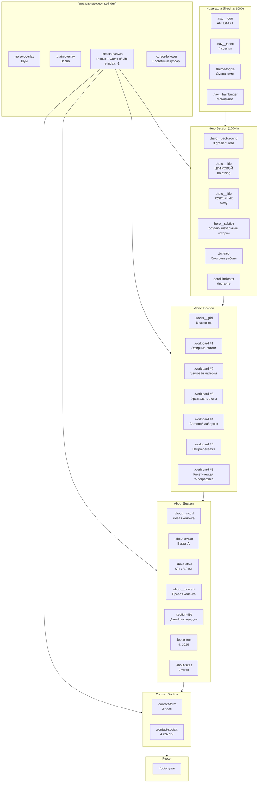

# АРТЕФАКТ | Медиа Художник — Структура страницы

Документация структуры портфолио медиа-художника с интерактивными эффектами.

---

## Визуальная структура



---

## Детальная структура

### 1. Глобальные слои

| Элемент | Описание | z-index |
|---------|----------|----------|
| `.noise-overlay` | Шумовой текстура - живой органический фон | 9999 |
| `.grain-overlay` | Зернистый текстура - плёнка | 9998 |
| `.plexus-canvas` | Canvas с частицами plexus и Game of Life | -1 |
| `.cursor-follower` | Кастомный курсор 4x4px | 9999 |

---

### 2. Навигация (`.nav`)

**Позиция:** Fixed, top
**z-index:** 1000
**Стиль:** Neo‑Grotesque 2.0, uppercase, широкий tracking

```
┌────────────────────────────────────────────────────────────┐
│  [АРТЕФАКТ]    Главная  Работы  О себе  Контакт    [◐]   │
│  logo          nav__link →    →      →         theme  │
└────────────────────────────────────────────────────────────┘
```

**Элементы:**

| Класс | Текст | Стиль |
|-------|-------|-------|
| `.logo-text` | АРТЕФАКТ | Syne 500, uppercase, +0.15em |
| `.nav__link` | Главная/Работы/О себе/Контакт | Space Grotesk 500, uppercase |
| `.theme-toggle` | Кнопка смены темы | Анимированный переключатель |

---

### 3. Hero Section (`#home`)

**Высота:** 100vh
**Анимация фона:** 3 gradient orb с параллаксом

```
┌────────────────────────────────────────────────────────────┐
│                        ○                                   │
│                    ○       ○                                 │
│                                                           │
│                      ЦИФРОВОЙ                             │
│                     ХУДОЖНИК                              │
│                                                           │
│            создаю визуальные истории                       │
│                                                           │
│              ┌──────────────────┐                          │
│              │ Смотреть работы  │                          │
│              └──────────────────┘                          │
│                                                           │
│                         │                                   │
│                      Листайте                               │
└────────────────────────────────────────────────────────────┘
```

**Типографика:**

| Элемент | Font | Size | Weight | Tracking |
|---------|------|------|--------|----------|
| Заголовки | Syne | clamp(3rem, 10vw, 7rem) | 200 (thin) | -0.05em |
| Подзаголовок | Space Grotesk | clamp(0.9rem, 1.6vw, 1rem) | 300 | +0.15em, uppercase |
| Кнопка | Space Grotesk | 0.75rem | 500 | +0.15em, uppercase |

**Эффекты:**
- `.breathing` — анимация "дыхания" букв
- `.wavy` — волнообразная анимация при hover
- `.scroll-text` — реакция на скролл

---

### 4. Works Section (`#works`)

**Layout:** CSS Grid, auto-fit, minmax 340px
**Карточки:** 6 штук с tilt эффектом

```
┌──────────────┬──────────────┬──────────────┐
│   ┌─────┐   │   ┌─────┐   │   ┌─────┐   │
│   │ 01  │   │   │ 02  │   │   │ 03  │   │
│   └─────┘   │   └─────┘   │   └─────┘   │
│ Generative   │ Interactive  │ 3D / WebGL   │
│ Эфирные      │ Звуковая     │ Фрактальные  │
│ потоки       │ материя      │ сны          │
├──────────────┼──────────────┼──────────────┤
│   ┌─────┐   │   ┌─────┐   │   ┌─────┐   │
│   │ 04  │   │   │ 05  │   │   │ 06  │   │
│   └─────┘   │   └─────┘   │   └─────┘   │
│ Installation │ AI Art       │ Motion       │
│ Световой     │ Нейро-       │ Кинетическая  │
│ лабиринт    │ пейзажи     │ типографика  │
└──────────────┴──────────────┴──────────────┘
```

**Структура карточки:**

```
┌────────────────────────────┐
│ ┌──────────────────────┐ │
│ │         01           │ │  ← .work-placeholder
│ │   [overlay]          │ │  ← .work-overlay
│ └──────────────────────┘ │
│ Generative Art            │  ← .work-category
│ Эфирные потоки            │  ← .work-title
│ Алгоритмическая генерация │  ← .work-description
└────────────────────────────┘
```

---

### 5. About Section (`#about`)

**Layout:** Grid 1.6fr — 1fr gap 5rem

```
┌─────────────────────────────────────────────────────────────┐
│  ┌─────┐                                                   │
│  │  ○  │  ┌────────────┐                                    │
│  │  A  │  │    50+     │  ┌─────────────────────┐         │
│  │     │  │  Проектов   │  │  О художнике        │         │
│  └─────┘  ├────────────┤  │                      │         │
│           │     8       │  │  Я исследую...      │         │
│           │  Лет опыта  │  │  Моя практика...    │         │
│           ├────────────┤  └─────────────────────┘         │
│           │    15+      │  ┌───┬───┬───┬───┐           │
│           │   Наград    │  │TD│Pr│Web│Th │  Skills  │
│           └────────────┘  │ee│oc│GL│re │           │
│                          │   │ss│SL│  │.js│           │
│  about__visual          │   │in│  │   │           │
│    + about_avatar        │   │g│Ma│   │           │
│    + about_stats         │   │  │x│   │           │
│                          │   │  │/ │   │           │
│                          │   │  │MS│   │           │
│                          │   │  │P │   │           │
│                          │   └───┴───┴───┴───┘           │
│                          │        about__content         │
└─────────────────────────────────────────────────────────────┘
```

**Элементы:**

| Класс | Описание |
|-------|----------|
| `.avatar-glow` | Свечение аватара, box-shadow |
| `.avatar-text` | Буква "A", Syne 200 |
| `.stat-number` | Число, Syne 300 |
| `.stat-label` | Метка, uppercase, +0.15em |
| `.skill-tag` | Тег навыка, uppercase, скруглённый |

---

### 6. Contact Section (`#contact`)

**Фон:** Gradient mesh
**Форма:** Неоморфизм с inset тенями

```
┌─────────────────────────────────────────────────────────────┐
│                    Давайте создадим                          │
│                       со здадим                              │
│                                                             │
│  ┌─────────────────────┐  ┌─────────────────────┐           │
│  │ Имя                 │  │ Email                │           │
│  └─────────────────────┘  └─────────────────────┘           │
│                                                             │
│  ┌─────────────────────────────────────────────────────┐     │
│  │ Сообщение                                           │     │
│  │                                                     │     │
│  └─────────────────────────────────────────────────────┘     │
│                                                             │
│         ┌──────────────┐                                     │
│         │  Отправить   │                                     │
│         └──────────────┘                                     │
│                                                             │
│  ┌─────────┬─────────┬─────────┬─────────┐                   │
│  │Instagram│ Behance │Dribbble │ArtStation│  Socials      │
│  └─────────┴─────────┴─────────┴─────────┘                   │
└─────────────────────────────────────────────────────────────┘
```

---

### 7. Footer (`.footer`)

```
┌─────────────────────────────────────────────────────────────┐
│     © 2025 АРТЕФАКТ. Все права защищены.         2025       │
│                      footer-text                footer-year    │
└─────────────────────────────────────────────────────────────┘
```

---

## Типографика: Neo‑Grotesque 2.0

### CSS Переменные

```css
/* Шрифты */
--font-display: 'Syne', sans-serif;
--font-body: 'Space Grotesk', sans-serif;

/* Tracking */
--tracking-tight: -0.05em;   /* Заголовки */
--tracking-display: -0.04em;
--tracking-body: -0.01em;    /* Body текст */
--tracking-wide: 0.15em;     /* Uppercase labels */

/* Weights */
--weight-thin: 200;
--weight-light: 300;
--weight-regular: 400;
--weight-medium: 500;
--weight-bold: 700;
```

### Шкала типографики

```
┌─────────────────────────────────────────────────────────────┐
│  Display (Syne)                  │  Body (Space Grotesk)        │
├─────────────────────────────────────────────────────────────┤
│  7rem / thin / -0.05em           │  1rem / light / -0.01em    │
│  ↑ HERO заголовки               │  ↑ Параграфы                │
│                                                             │
│  4.5rem / thin / -0.05em        │  0.75rem / medium / +0.15em │
│  ↑ Section заголовки            │  ↑ Кнопки, labels           │
│                                                             │
│  2rem / light / -0.01em         │  0.65rem / medium / +0.15em │
│  ↑ Статистика, footer           │  ↑ Categories, meta         │
└─────────────────────────────────────────────────────────────┘
```

---

## Интерактивные эффекты

### Светлая тема

| Элемент | Цвет | Эффект |
|---------|------|--------|
| Plexus частицы | `rgb(100, 100, 120)` | Связи < 80px |
| Game of Life | `rgb(10, 10, 12)` | Тёмные клетки |
| Тени букв | box-shadow | От курсора |

### Тёмная тема

| Элемент | Цвет | Эффект |
|---------|------|--------|
| Plexus частицы | `rgb(150, 180, 255)` | Голубые связи |
| Game of Life | `rgb(245, 245, 182)` | Тёплые светлые |
| Тени букв | text-shadow | Длинные (40-160px) |
| Свет курсора | Тёплый LED | 2700-3000K |

---

## Файловая структура

```
tests/5-test/
├── index.html         # HTML структура
├── style.css          # Стили (Neo‑Grotesque 2.0)
└── script.js          # Интерактивность:
                      ├── Plexus система
                      ├── Game of Life
                      ├── Динамические тени
                      ├── Эффект перегрева
                      └── 3D сфера частиц
```

---

## Z-Index иерархия

```
9999  ─  .noise-overlay, .cursor-follower
9998  ─  .grain-overlay
1000  ─  .nav
10    ─  .kinetic-char, .logo-text, .skill-tag
5     ─  .hero__content
-1    ─  .plexus-canvas (Game of Life + Plexus)
```

---

*Документ создан: 2025-01-12*
